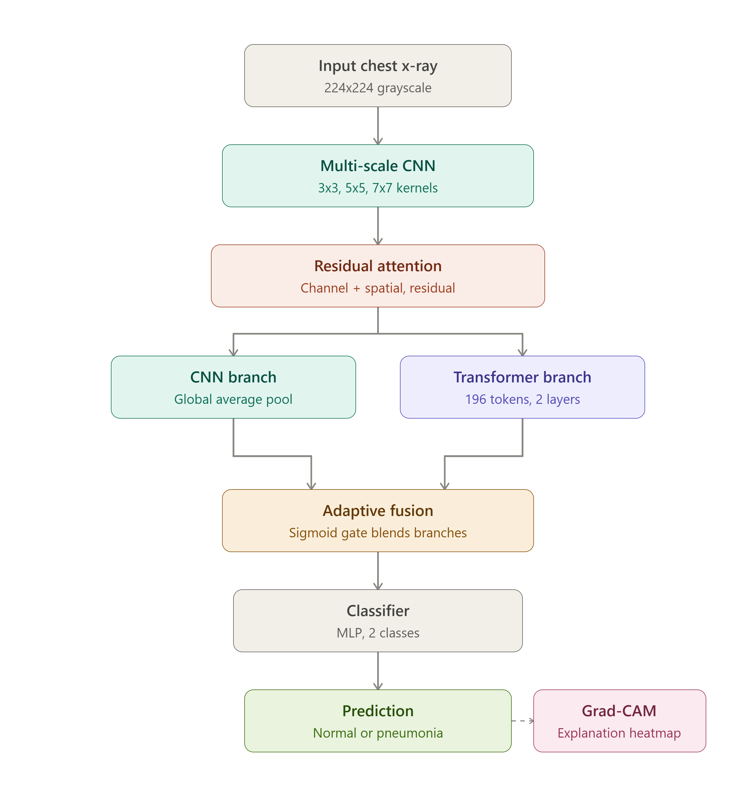

# HybridXRayNet

### Hybrid CNN–Transformer Network for Pneumonia Detection from Chest X-rays

HybridXRayNet is a deep learning research project for binary chest X-ray classification: **Normal** vs **Pneumonia**.

The model combines **multi-scale convolutional feature extraction**, **residual channel and spatial attention**, a lightweight **Transformer encoder for global context**, and a learned **adaptive fusion gate** that combines local CNN features with global Transformer representations. The project also includes **Grad-CAM explainability** and a lightweight **Flask inference application** for interactive predictions.

> **Research / educational project only.** This system is not clinically validated and must not be used as a medical diagnostic tool.

---

## Results

The currently documented held-out test-set run achieved:

| Metric | Result |
|---|---:|
| **Accuracy** | **83.17%** |
| **Precision** | **79.26%** |
| **Recall** | **98.97%** |
| **F1 Score** | **88.03%** |
| **ROC-AUC** | **96.67%** |

### Confusion Matrix

```text
                 Predicted
              NORMAL  PNEUMONIA
NORMAL          133      101
PNEUMONIA        4       386
```

The documented run therefore correctly identified **386 of 390 pneumonia cases**. The main trade-off is a relatively high number of false positives for the Normal class.

These numbers are a **single project benchmark**, not a clinical validation study. Results can vary with dataset version, hardware, software versions, and training conditions.

---

## Architecture



### Model Components

**1. Multi-Scale CNN**

Three parallel convolution branches with **3×3, 5×5, and 7×7 kernels** capture patterns at different receptive-field sizes. Their outputs are concatenated and refined into a 128-channel feature map.

**2. Residual Channel + Spatial Attention**

The attention module first learns which feature channels are important using channel attention, followed by spatial attention that emphasizes informative regions. A residual connection preserves the original feature representation.

**3. Transformer Context Module**

The attended feature map is reduced to **14×14**, producing **196 tokens** before entering a 2-layer Transformer encoder with **8 attention heads**.

**4. Adaptive Fusion**

A learned sigmoid gate dynamically determines the contribution of the CNN and Transformer representations:

```text
fused = gate × CNN + (1 − gate) × Transformer
```

The resulting 128-dimensional representation is passed through an MLP classifier.

---

## Why a Hybrid CNN–Transformer?

Chest X-rays contain both fine-grained local patterns and broader spatial relationships.

- **CNN branch:** local and multi-scale visual features
- **Attention block:** informative channels and spatial regions
- **Transformer branch:** longer-range relationships across the feature map
- **Adaptive fusion:** input-dependent weighting of CNN and Transformer representations
- **Grad-CAM:** visual indication of regions associated with the prediction

---

## Dataset

The training pipeline expects:

```text
chest_xray/
├── train/
│   ├── NORMAL/
│   └── PNEUMONIA/
├── val/
│   ├── NORMAL/
│   └── PNEUMONIA/
└── test/
    ├── NORMAL/
    └── PNEUMONIA/
```

The dataset itself is **not included** in this repository.

If `val/` is absent, the training script creates a **10% validation split** from the training data while leaving the original training images in place.

### Preprocessing

- Grayscale conversion
- Resize to **224×224**
- Tensor conversion
- Normalization with mean `0.5` and standard deviation `0.5`

### Training augmentation

- Random horizontal flip
- Random rotation up to 7°
- Small translations
- Scale jitter from `0.95` to `1.05`

---

## Grad-CAM Explainability

The application includes Grad-CAM visualization to highlight image regions associated with the prediction.

> Grad-CAM is provided for interpretability and research purposes. It does not establish clinical validity or provide medical evidence.

---

## Training Configuration

The documented benchmark was produced with the project configuration described below:

| Setting | Value |
|---|---|
| Optimizer | AdamW |
| Learning Rate | `3e-4` |
| Weight Decay | `1e-4` |
| Reported benchmark batch size | `4` |
| Default CLI batch size | `16` |
| Early Stopping | Validation F1 |
| Image Size | `224×224` |
| Random Seed | `42` |
| Epochs | Configurable |

The batch size used for the documented benchmark was selected with a **4 GB RTX 3050** in mind.

---

## Project Structure

```text
HybridXRayNet/
├── train_model.py
├── app.py
├── requirements.txt
├── templates/
│   └── index.html
├── assets/
│   ├── hybridxraynet_architecture.png
│   └── hybridxraynet_architecture1.png
├── tests/
├── outputs/              # generated locally; ignored by Git
└── README.md
```

Generated training artifacts include:

```text
outputs/
├── best_model.pth
├── training_history.json
├── model_config.json
├── test_metrics.json
├── confusion_matrix.png
├── roc_curve.png
└── loss_curve.png
```

---

## Setup

### 1. Clone

```bash
git clone https://github.com/Ritanshu-Kumar/HybridXRayNet.git
cd HybridXRayNet
```

### 2. Virtual environment

**Windows**
```bash
python -m venv .venv
.venv\Scripts\activate
```

**Linux / macOS**
```bash
python3 -m venv .venv
source .venv/bin/activate
```

### 3. Install dependencies

For the CUDA 12.1 PyTorch build used during development:

```bash
pip install torch==2.3.1 torchvision==0.18.1 --index-url https://download.pytorch.org/whl/cu121
pip install -r requirements.txt
```

For CPU-only environments or another CUDA version, install the appropriate PyTorch/torchvision build first, then install the remaining dependencies from `requirements.txt`.

---

## Train

Place the dataset at:

```text
chest_xray/
```

Then:

```bash
python train_model.py --data-dir chest_xray --epochs 15 --batch-size 4
```

The best checkpoint is written to:

```text
outputs/best_model.pth
```

---

## Run the Web Application

After training:

```bash
python app.py
```

Open:

```text
http://127.0.0.1:5001
```

The application reports:

- predicted class
- confidence score
- inference device
- Grad-CAM visualization

---

## Reproducibility

The training script seeds:

- Python
- NumPy
- PyTorch
- CUDA

with a default seed of:

```text
42
```

This improves reproducibility, but exact results can still differ across hardware and software environments.

---

## Testing

The repository includes lightweight tests for project contracts such as:

- required architecture components
- CLI defaults
- required assets
- dependency pins

Run:

```bash
python -m unittest discover -s tests -v
```

These tests do **not** retrain the model or modify the dataset.

---

## Limitations

- Research/educational prototype; not clinically validated.
- Performance depends heavily on the training dataset.
- Generalization to other hospitals, scanners, populations, and acquisition protocols has not been established.
- The documented confusion matrix shows a relatively high number of false positives for the Normal class.
- No independent external validation is included in this repository.
- Grad-CAM visualizations should be interpreted as model explanations, not medical evidence.
- Clinical deployment would require extensive external validation, calibration, clinical evaluation, robust data governance, and appropriate regulatory review.

---

## Tech Stack

Python · PyTorch · torchvision · scikit-learn · NumPy · Pillow · Matplotlib · Flask

---

## License

MIT License. See [LICENSE](LICENSE).
