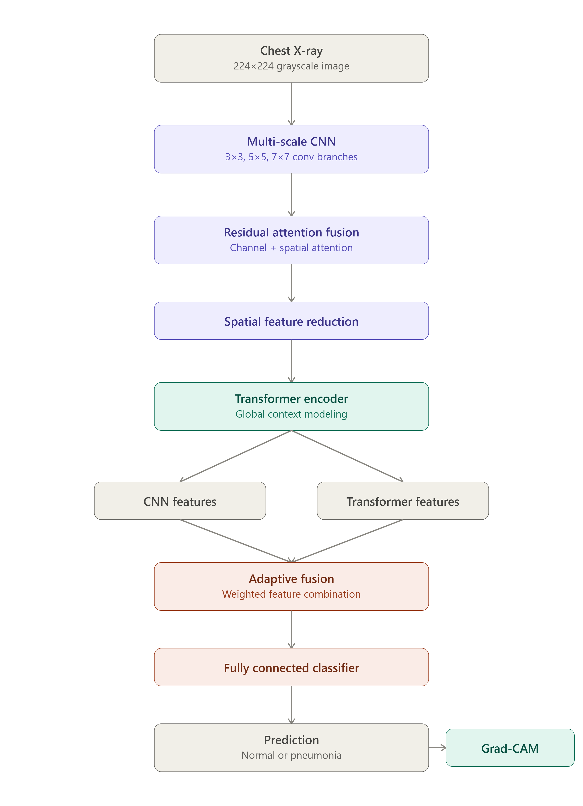

# HybridXRayNet

**Hybrid CNN-Transformer pneumonia detection from chest X-rays**

HybridXRayNet classifies chest X-ray images as **Normal** or **Pneumonia**. It combines multi-scale convolutional feature extraction with residual attention, a Transformer encoder for global context, and adaptive fusion of the two feature streams. Grad-CAM is included so predictions come with a visual explanation.

## Architecture

The image goes through a multi-scale CNN (3×3 / 5×5 / 7×7 branches), then residual channel + spatial attention, then a spatial reduction step before entering a Transformer encoder for global context. The CNN and Transformer feature streams are then adaptively fused and passed to a fully connected classifier. Grad-CAM runs on the final prediction to produce a heatmap.



## Dataset

Expects a standard NORMAL / PNEUMONIA chest X-ray dataset laid out as:

```
chest_xray/
├── train/
│   ├── NORMAL/
│   └── PNEUMONIA/
├── val/
│   ├── NORMAL/
│   └── PNEUMONIA/
└── test/
    ├── NORMAL/
    └── PNEUMONIA/
```

The dataset itself isn't included in this repo (size + distribution reasons). If `val/` is missing, the training script carves out 10% of the training set automatically. The test set is never touched during training.

Images are converted to grayscale, resized to 224×224, and normalized. Training uses light augmentation: horizontal flips, small rotations, small translations, small scale jitter.

## Training setup

- Optimizer: AdamW, lr 3e-4, weight decay 1e-4
- Batch size 4 (tuned for a 4GB RTX 3050)
- Early stopping on validation F1
- Epoch count configurable

## Results

Held-out test set:

| Metric | Result |
|---|---|
| Accuracy | 83.17% |
| Precision | 79.26% |
| Recall | 98.97% |
| F1 Score | 88.03% |
| ROC-AUC | 96.67% |

```
                 Predicted
              NORMAL  PNEUMONIA
NORMAL          133      101
PNEUMONIA        4       386
```

386 of 390 pneumonia cases were caught correctly — recall is the strength here. The trade-off is Normal-class recall, since a chunk of Normal images get flagged as false-positive pneumonia.

Numbers will shift a bit with different seeds, hardware, or dataset versions.

## Explainability

Grad-CAM overlays a heatmap on the input X-ray showing which regions drove the prediction. This is for interpretability and research — not a diagnostic tool.

## Project structure

```
HybridXRayNet/
├── train_model.py      # model, training, evaluation
├── app.py               # Flask inference app
├── requirements.txt
├── templates/index.html
├── outputs/              # trained model + eval artifacts
└── README.md
```

## Setup

```bash
git clone https://github.com/Ritanshu-Kumar/HybridXRayNet.git
cd HybridXRayNet

python -m venv .venv
.venv\Scripts\activate

# CUDA 12.1 build
pip install torch==2.3.1 torchvision==0.18.1 --index-url https://download.pytorch.org/whl/cu121

pip install -r requirements.txt
```

## Training

```bash
python train_model.py --data-dir chest_xray --epochs 15 --batch-size 4
```

Outputs land in `outputs/`: `best_model.pth`, `training_history.json`, `model_config.json`, `test_metrics.json`, `confusion_matrix.png`, `roc_curve.png`.

## Running the app

Once `outputs/best_model.pth` exists:

```bash
python app.py
```

Then open `http://127.0.0.1:5001` and upload an X-ray to get a predicted class, confidence score, and Grad-CAM overlay.

## Limitations

This is a research/educational project, not a clinically validated diagnostic system. Results depend heavily on the training dataset, and false positives on the Normal class are a known issue with the current model. It hasn't been validated on external datasets, which would be a prerequisite for any real-world use.

## License

For educational and research use.